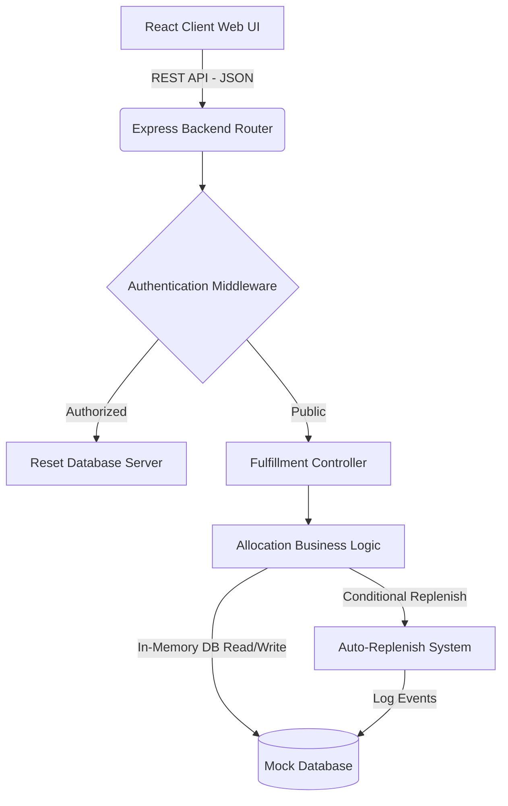

# System Architecture Document
**Multi-Warehouse Stock Allocation & Replenishment Optimizer**

This document outlines the architectural components, technology choices, and data-flow specifications for the Multi-Warehouse Allocation Engine.

---

## 1. Architectural Overview

The application follows a decoupled client-server architecture containing a thin-database abstraction layer. The core services are separated into distinct modules to enforce clear separation of concerns (SoC).

---

## 2. Technology Choices & Justification

### Core Tech Stack
- **Frontend Framework**: **React 19 (via Vite)**
  - *Why*: Vite provides instantaneous Hot Module Replacement (HMR) and extremely fast build times. React allows us to manage dynamic component states (such as live stock level gauges, logs, and canvas grids) in a declarative manner.
- **Styling**: **Vanilla CSS (Custom variables & backdrop filters)**
  - *Why*: Custom CSS variables offer complete creative control over the premium dark glassmorphic styling system, animations, and custom scrollbars without introducing bulky utility framework footprints.
- **Backend Environment**: **Node.js with Express**
  - *Why*: Standard choice for lightweight API services. Minimal boilerplate, fast execution, and native support for asynchronous JSON exchanges.
- **Mock Database Layer**: **In-Memory JavaScript State Object**
  - *Why*: Meets the zero-setup assessment requirement. Allows fast state resets between test assertions, making Jest runs fast and reliable.

### Quality Assurance & Verification
- **Testing Framework**: **Jest**
  - *Why*: Zero-config test runner supporting in-band test executions. Excellent snapshotting, assertion utilities, and reporting.
- **API Client Integration**: **Supertest**
  - *Why*: Enables spinning up the Express HTTP handler in-memory to test endpoint schemas and middlewares without binding to active TCP ports, preserving isolated test environments.

---

## 3. Data Flow Specification

### 3.1 Order Fulfillment Sequence
1. **Initiation**: The customer clicks the interactive coordinate canvas or fills the dashboard order form and dispatches the payload.
2. **Ingress Validation**: Express inspects coordinate bounds ($0 \le X, Y \le 100$), SKU validity, and positive integer quantities.
3. **Proximity Mapping**: The `allocationEngine` maps customer coordinates to active warehouses, computing Euclidean distances:
   $$d = \sqrt{(x_{wh} - x_{cust})^2 + (y_{wh} - y_{cust})^2}$$
4. **Capacity & Stock Check**:
   - Warehouses are sorted from closest to furthest.
   - Warehouses are filtered by remaining daily processing capacity (VIP orders bypass this constraint).
   - The engine attempts single-warehouse fulfillment first. If insufficient, it attempts a 2-warehouse split shipment. If still short, it allocates best-effort stock and marks the remainder as `Backordered`.
5. **Egress & State Commit**: Warehouse inventory and allocation counts are updated. A REST response is returned.

### 3.2 Automated Replenishment Loop
1. During allocation, if product stock drops $\le$ `Product.threshold`, an automatic replenishment routine triggers.
2. The warehouse receives `Product.reorderQty` back into stock.
3. A replenishment log entry is registered in the database, emitting a live alert feed to the React UI on the next poll.
