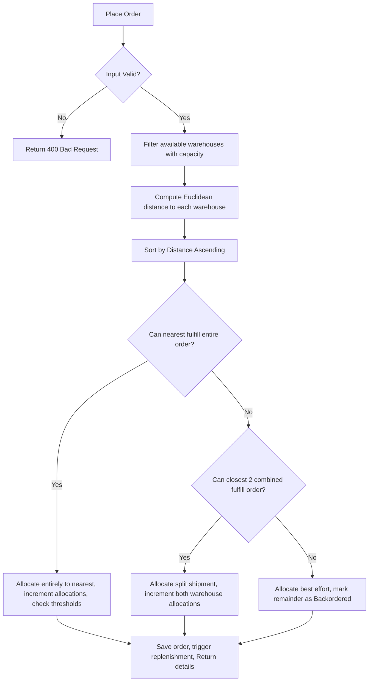

# System Design Document
**Multi-Warehouse Stock Allocation & Replenishment Optimizer**

This document describes the data structures, API endpoints, error handling rules, and core algorithm designs.

---

## 1. Data Schema & Models

The backend utilizes structured objects representing products, warehouses, orders, and logs.

### 1.1 Product Model
```typescript
interface Product {
  sku: string;             // Unique identifier (e.g. "SKU-1001")
  name: string;            // Human-readable product title
  threshold: number;       // Safety stock level triggering replenishment
  reorderQty: number;      // Amount of stock added during replenishment
  weight: number;          // Product unit weight (kg)
}
```

### 1.2 Warehouse Model
```typescript
interface Warehouse {
  code: string;                  // Unique identifier (e.g. "WH-SEA")
  name: string;                  // Warehouse title
  x: number;                     // 2D grid coordinates (0-100)
  y: number;                     // 2D grid coordinates (0-100)
  maxCapacity: number;           // Maximum processing orders per day
  currentAllocations: number;    // Allocated orders fulfilled today
  inventory: Record<string, number>; // Map of SKU to stock quantity
}
```

### 1.3 Order / Fulfillment Model
```typescript
interface Order {
  orderId: string;               // Unique ID generated on creation
  customerName: string;
  coordinates: { x: number, y: number };
  shippingTier: "Standard" | "VIP";
  timestamp: string;             // ISO date string
  items: Array<{ sku: string, quantity: number }>;
  shipments: Array<{
    warehouseCode: string;
    distance: number;            // Distance from customer
    items: Array<{ sku: string, quantity: number }>;
  }>;
  status: "Fulfilled" | "Partially Fulfilled" | "Backordered";
  backorderedItems?: Array<{ sku: string, quantity: number }>;
}
```

---

## 2. API Endpoints

### 2.1 Get System Inventory
- **URL**: `/api/inventory`
- **Method**: `GET`
- **Response Code**: `200 OK`
- **Payload**:
  ```json
  {
    "warehouses": {
      "WH-SEA": { "code": "WH-SEA", "name": "Seattle", "x": 10, "y": 90, "maxCapacity": 5, "currentAllocations": 0, "inventory": { "SKU-1001": 20 } }
    },
    "products": {
      "SKU-1001": { "sku": "SKU-1001", "name": "Laser Printer", "threshold": 10, "reorderQty": 25, "weight": 8.5 }
    },
    "replenishmentLogs": [],
    "orders": []
  }
  ```

### 2.2 Place Order
- **URL**: `/api/orders`
- **Method**: `POST`
- **Request Headers**: `Content-Type: application/json`
- **Request Payload**:
  ```json
  {
    "customerName": "Acme Corp",
    "coordinates": { "x": 15, "y": 85 },
    "shippingTier": "Standard",
    "items": [{ "sku": "SKU-1001", "quantity": 2 }]
  }
  ```
- **Success Response (201 Created)**:
  ```json
  {
    "message": "Order processed successfully",
    "fulfillment": {
      "orderId": "ORD-1723821039-492",
      "status": "Fulfilled",
      "shipments": [{
        "warehouseCode": "WH-SEA",
        "distance": 7.07,
        "items": [{ "sku": "SKU-1001", "quantity": 2 }]
      }]
    }
  }
  ```

### 2.3 Reset Database
- **URL**: `/api/reset`
- **Method**: `POST`
- **Request Headers**: `x-auth-role: admin` (Required)
- **Response**:
  - `200 OK`: `{"message": "Database reset to seed data successfully"}`
  - `403 Forbidden`: `{"error": "Access Denied: Admin authorization required"}`

---

## 3. Key Algorithmic Flows

### 3.1 Proximity Allocation Check


---

## 4. Error Handling & Security

- **JSON Ingress Checks**: Try-catch blocks wrap Express JSON parsers to prevent corrupted packets crashing the runtime.
- **Input Boundaries**: Order quantities are validated to ensure positive non-zero integers, and coordinate parameters are restricted to $0 \le X, Y \le 100$ boundaries.
- **Unauthorized Actions Safeguard**: Admin control endpoints (like manual system resets) are protected by looking for the `x-auth-role: admin` header. If absent or invalid, a `403 Forbidden` response is returned.
